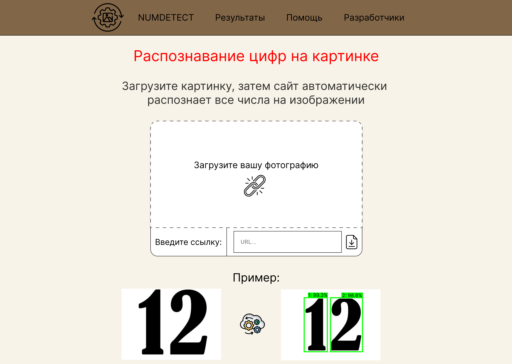
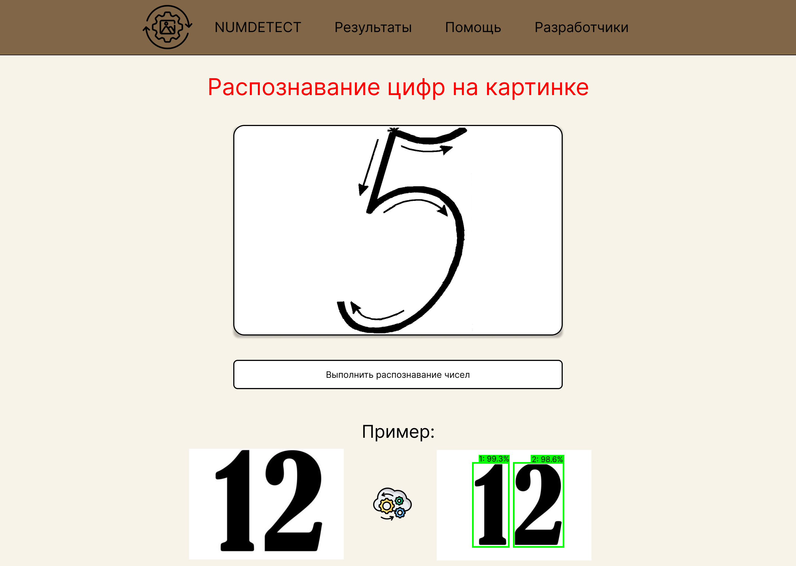
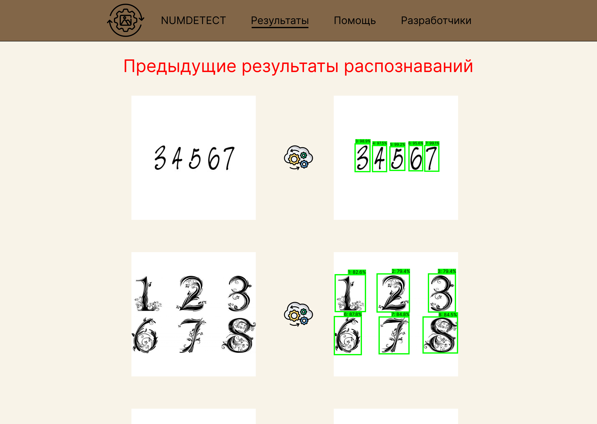
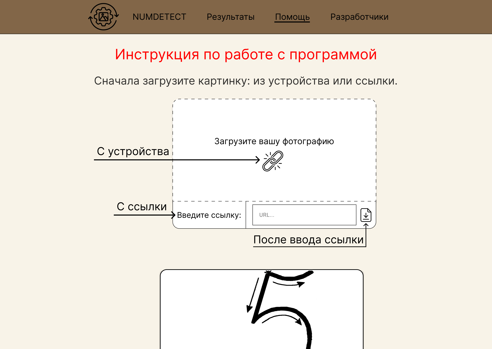
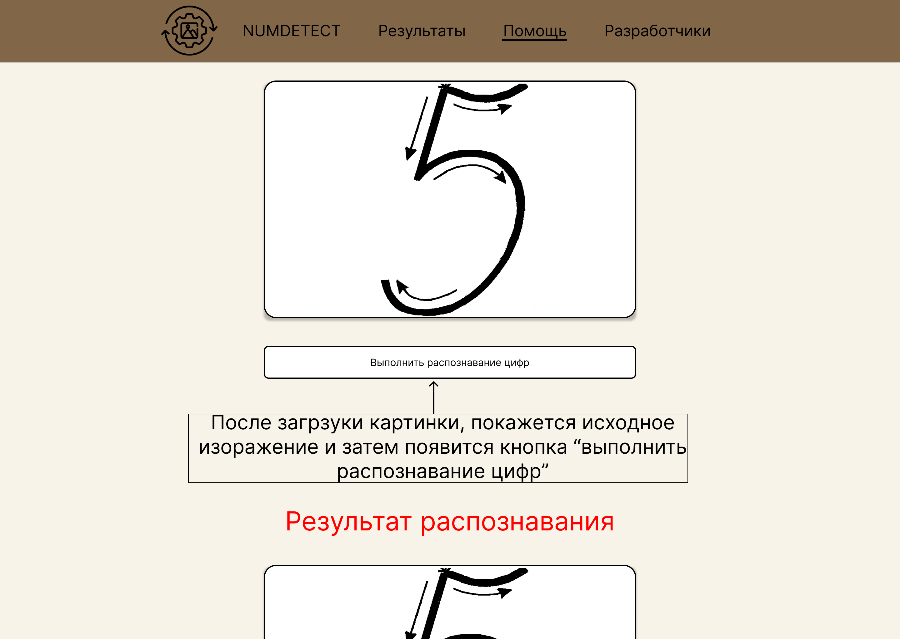
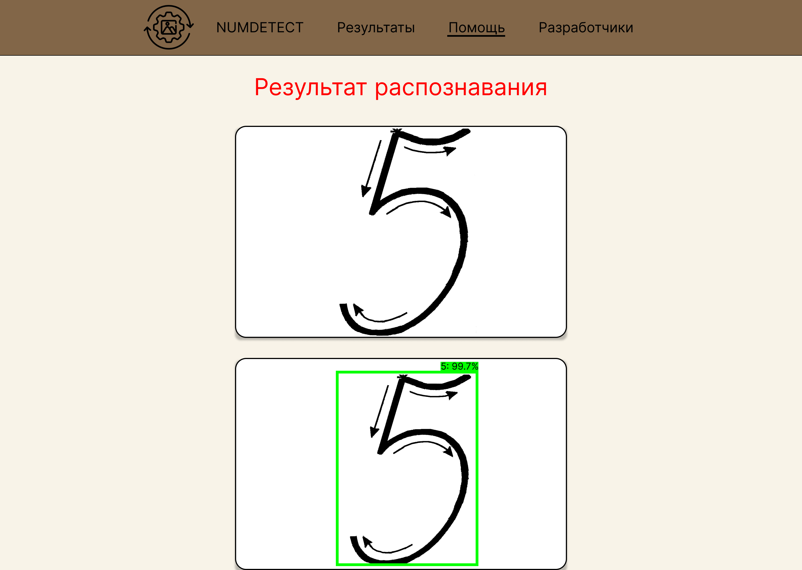
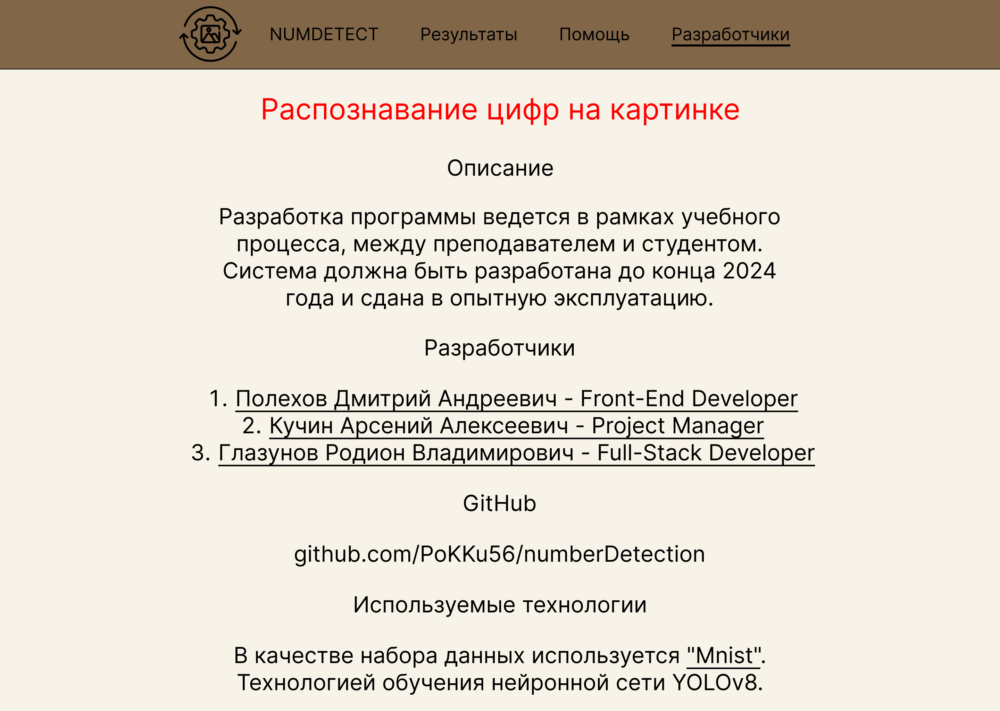

# Макет проекта 

<h1> Главная страница с распознаванием цифр </h1>

<h1> Страница с предыдущими результатами </h1>

<h1> Помощь по работе с программой </h1>

<h1> Информация о разработчиках проекта </h1>
